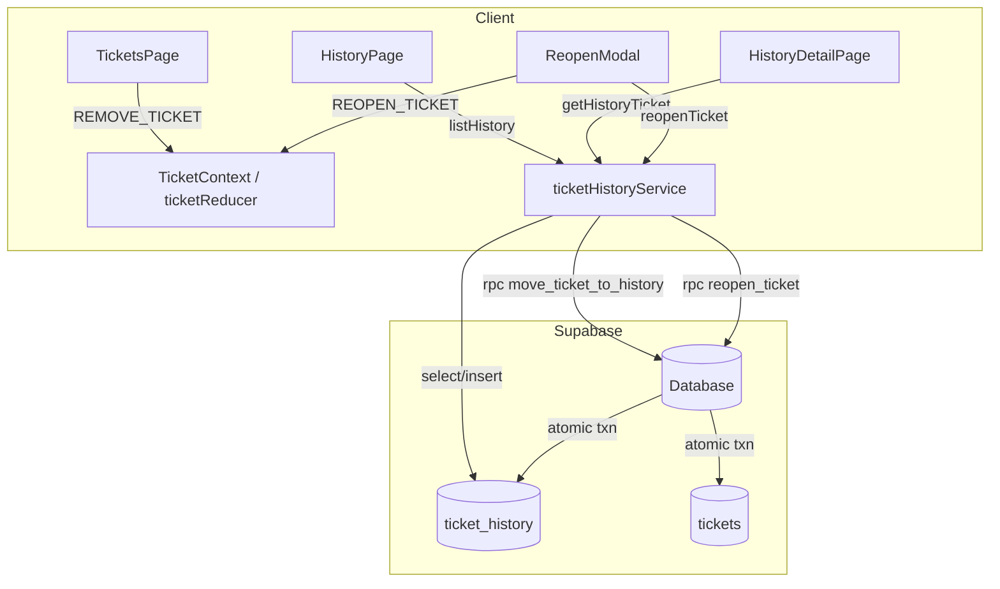
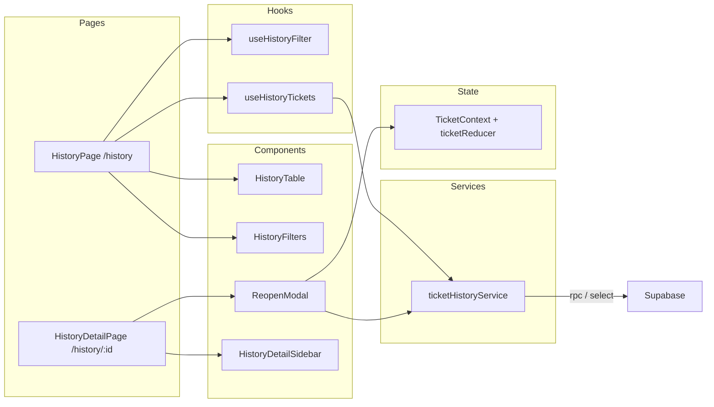

# Design Document — Resolved Ticket History

## Overview

This feature moves `Resolved` and `Closed` tickets out of the active `tickets` table and into a dedicated `ticket_history` table in Supabase. It exposes a new `/history` route where agents can browse, filter, and search past tickets, view their full read-only detail, and reopen any of them back to `Open`. The active Tickets page is updated to exclude resolved/closed work by default.

The implementation layers neatly on top of the existing architecture: a new Supabase RPC handles the atomic move/reopen, a new service module mirrors the pattern of `ticketService.ts`, two new reducer actions extend the existing `ticketReducer`, and a cluster of new page/component files follow the established folder conventions.



### Design decisions

- **Two RPC functions instead of client-side multi-step calls.** Atomicity is a hard requirement (Req 8.2–8.5). A single `supabase.rpc()` call keeps both table mutations inside one database transaction.
- **History state is NOT kept in TicketContext.** History tickets are large in number, infrequently accessed, and filtered server-side. Loading them into the global reducer would waste memory and complicate cache invalidation. Instead, `HistoryPage` manages its own local state via `useState` + `useEffect`.
- **REMOVE_TICKET and REOPEN_TICKET are the only changes to ticketReducer.** All other reducer actions and the context shape remain untouched.
- **`useHistoryFilter` hook** mirrors the `useFilterState` pattern, storing history filter state in URL search params so the back button restores filter context.
- **`TicketsPage` default filter** is implemented by pre-filtering `state.tickets` inside `useTickets` to exclude `Resolved`/`Closed` when no explicit status filter is active, keeping the existing `FilterState` shape unchanged.

---

## Architecture



---

## Components and Interfaces

### New pages

#### `src/pages/HistoryPage.tsx`

Top-level page for `/history`. Owns loading and error state, composes `HistoryFilters`, `HistoryTable`, and `Pagination`.

```ts
// No props — reads route params internally
```

#### `src/pages/HistoryDetailPage.tsx`

Renders full read-only detail for a single history ticket at `/history/:id`. Fetches the record on mount, shows not-found state if missing, renders `HistoryDetailHeader`, `HistoryDetailSidebar`, `Timeline`, and the `ReopenModal`.

```ts
// No props — reads :id from useParams
```

---

### New components

#### `src/components/history/HistoryTable.tsx`

```ts
interface HistoryTableProps {
  rows: HistoryTicket[];
  loading: boolean;   // shows <LoadingSkeleton rows={5} /> when true
}
```

Renders an `<table>` with columns: Ticket ID, Subject, Customer Name, Priority, Status, Assignee, Resolved At, Resolved By. Each row is a `<HistoryRow>` that navigates to `/history/:id` on click. Uses the existing `Badge` component for Status and Priority. When `rows` is empty and not loading, delegates to `EmptyState`.

#### `src/components/history/HistoryRow.tsx`

```ts
interface HistoryRowProps {
  ticket: HistoryTicket;
}
```

Single `<tr>` for the history table. Navigates to `/history/${ticket.id}` via `useNavigate` on row click.

#### `src/components/history/HistoryFilters.tsx`

```ts
interface HistoryFiltersProps {
  filter: HistoryFilter;
  assigneeOptions: string[];  // loaded from service; fallback to [] on error
  onFilterChange: (patch: Partial<HistoryFilter>) => void;
  dateError: string | null;   // shown inline when fromDate > toDate
}
```

Renders date-range inputs (`from` / `to`), priority dropdown, assignee dropdown, and text search. Inline validation error displayed below the date inputs when `dateError` is non-null.

#### `src/components/history/ReopenModal.tsx`

```ts
interface ReopenModalProps {
  isOpen: boolean;
  ticket: HistoryTicket;
  onClose: () => void;
  onSuccess: () => void;  // called after successful reopen; page navigates to /history
}
```

Wraps the existing `Modal`. Contains an assignee `<select>` (same `ASSIGNEE_OPTIONS` list as elsewhere), an optional textarea (max 1000 chars) for the reason, a validation error adjacent to the dropdown when submitted without a selection, loading state that disables both controls during the RPC call, and an inline error if the RPC fails.

#### `src/components/history/HistoryDetailHeader.tsx`

```ts
interface HistoryDetailHeaderProps {
  ticket: HistoryTicket;
}
```

Mirrors `TicketDetailHeader` but links back to `/history` (restoring query params from `location.state.from`) and adds resolved_at / resolved_by metadata beneath the subject line.

#### `src/components/history/HistoryDetailSidebar.tsx`

```ts
interface HistoryDetailSidebarProps {
  ticket: HistoryTicket;
}
```

Read-only counterpart of `TicketDetailSidebar`. Displays Status, Priority, Assignee, Customer, Created, Resolved At, Resolved By, Tags — all as plain text, no `<select>` controls. The "Reopen" button is rendered here; clicking it notifies the parent page to open `ReopenModal`.

---

### New hooks

#### `src/hooks/useHistoryFilter.ts`

Mirrors `useFilterState`. Parses `HistoryFilter` from URL search params and writes back on change. Validates that `fromDate ≤ toDate`, returning a `dateError: string | null`.

```ts
export function useHistoryFilter(): [
  HistoryFilter,
  (patch: Partial<HistoryFilter>) => void,
  string | null   // dateError
]
```

#### `src/hooks/useHistoryTickets.ts`

Manages the async fetch lifecycle for the history list. Calls `ticketHistoryService.listHistory(filter)` with a 300 ms debounce on the `search` field; fires immediately for all other filter changes.

```ts
export interface UseHistoryTicketsResult {
  rows: HistoryTicket[];
  loading: boolean;
  error: string | null;
}

export function useHistoryTickets(filter: HistoryFilter): UseHistoryTicketsResult
```

---

## Data Models

### New TypeScript types (add to `src/types/index.ts`)

```ts
export interface HistoryTicket {
  id: string;
  subject: string;
  customerName: string;
  customerEmail: string;
  priority: Priority;
  status: 'Resolved' | 'Closed';    // only terminal statuses
  assignee: string;
  description: string;
  createdAt: string;                 // ISO 8601
  updatedAt: string;                 // ISO 8601
  tags: string[];
  comments: Comment[];
  events: SystemEvent[];
  resolvedAt: string;                // ISO 8601 — UTC timestamp of move
  resolvedBy: string;                // assignee name or "unassigned"
}

export interface HistoryFilter {
  fromDate: string;      // ISO date string or '' for no lower bound
  toDate: string;        // ISO date string or '' for no upper bound
  priority: Priority | '';
  assignee: string;
  search: string;
}
```

### Supabase schema

#### `ticket_history` table DDL

```sql
CREATE TABLE ticket_history (
  id             text        PRIMARY KEY,
  subject        text        NOT NULL,
  customer_name  text        NOT NULL,
  customer_email text        NOT NULL,
  priority       text        NOT NULL,
  status         text        NOT NULL,
  assignee       text        NOT NULL DEFAULT '',
  description    text        NOT NULL DEFAULT '',
  created_at     timestamptz NOT NULL,
  updated_at     timestamptz NOT NULL,
  tags           jsonb       NOT NULL DEFAULT '[]',
  comments       jsonb       NOT NULL DEFAULT '[]',
  events         jsonb       NOT NULL DEFAULT '[]',
  resolved_at    timestamptz NOT NULL,
  resolved_by    text        NOT NULL CHECK (char_length(resolved_by) <= 255)
);
```

#### Row Level Security

```sql
ALTER TABLE ticket_history ENABLE ROW LEVEL SECURITY;

-- Allow all operations for the anon role (mirrors the existing tickets table policy)
CREATE POLICY "anon full access"
  ON ticket_history
  FOR ALL
  TO anon
  USING (true)
  WITH CHECK (true);
```

#### RPC: `move_ticket_to_history`

Atomically moves a single ticket from `tickets` to `ticket_history`. Called by `ticketHistoryService.moveTicketToHistory()`.

```sql
CREATE OR REPLACE FUNCTION move_ticket_to_history(
  p_ticket_id  text,
  p_resolved_at timestamptz,
  p_resolved_by text
)
RETURNS void
LANGUAGE plpgsql
SECURITY DEFINER
AS $$
DECLARE
  v_ticket tickets%ROWTYPE;
BEGIN
  -- Lock and fetch the source row
  SELECT * INTO v_ticket
  FROM tickets
  WHERE id = p_ticket_id
  FOR UPDATE;

  IF NOT FOUND THEN
    RAISE EXCEPTION 'Ticket % not found', p_ticket_id;
  END IF;

  -- Insert into history
  INSERT INTO ticket_history (
    id, subject, customer_name, customer_email,
    priority, status, assignee, description,
    created_at, updated_at, tags, comments, events,
    resolved_at, resolved_by
  ) VALUES (
    v_ticket.id, v_ticket.subject, v_ticket.customer_name, v_ticket.customer_email,
    v_ticket.priority, v_ticket.status, v_ticket.assignee, v_ticket.description,
    v_ticket.created_at, v_ticket.updated_at, v_ticket.tags, v_ticket.comments, v_ticket.events,
    p_resolved_at, p_resolved_by
  );

  -- Delete from active table
  DELETE FROM tickets WHERE id = p_ticket_id;
END;
$$;
```

#### RPC: `reopen_ticket`

Atomically moves a history ticket back to `tickets` with status `Open` and the chosen assignee.

```sql
CREATE OR REPLACE FUNCTION reopen_ticket(
  p_ticket_id  text,
  p_assignee   text,
  p_reason     text    -- empty string if no reason provided
)
RETURNS void
LANGUAGE plpgsql
SECURITY DEFINER
AS $$
DECLARE
  v_hist ticket_history%ROWTYPE;
  v_now  timestamptz := now();
BEGIN
  SELECT * INTO v_hist
  FROM ticket_history
  WHERE id = p_ticket_id
  FOR UPDATE;

  IF NOT FOUND THEN
    RAISE EXCEPTION 'History ticket % not found', p_ticket_id;
  END IF;

  -- Re-insert into active tickets with Open status and new assignee
  INSERT INTO tickets (
    id, subject, customer_name, customer_email,
    priority, status, assignee, description,
    created_at, updated_at, tags, comments, events
  ) VALUES (
    v_hist.id, v_hist.subject, v_hist.customer_name, v_hist.customer_email,
    v_hist.priority, 'Open', p_assignee, v_hist.description,
    v_hist.created_at, v_now, v_hist.tags, v_hist.comments, v_hist.events
  );

  -- Delete from history
  DELETE FROM ticket_history WHERE id = p_ticket_id;
END;
$$;
```

> Note: the reason comment is appended by the client after the RPC returns (via the existing `ticketService.addComment`) so it appears in the reopened ticket's timeline. Reason handling at the DB level would require embedding business logic in the RPC and coupling it to the comment schema — keeping it client-side is simpler.

---

### Reducer additions (`src/context/ticketReducer.ts`)

Two new action types are added to the existing `TicketAction` union:

```ts
| { type: 'REMOVE_TICKET'; ticketId: string }
| { type: 'REOPEN_TICKET'; payload: Ticket }
```

New `case` branches in `ticketReducer`:

```ts
case 'REMOVE_TICKET':
  return {
    ...state,
    tickets: state.tickets.filter(t => t.id !== action.ticketId),
  };

case 'REOPEN_TICKET':
  // Prepend so the ticket appears at the top of the active list
  return {
    ...state,
    tickets: [action.payload, ...state.tickets],
  };
```

---

## Service layer — `src/services/ticketHistoryService.ts`

```ts
import { supabase } from '../lib/supabase';
import type { HistoryTicket, HistoryFilter, Priority } from '../types';

// ---------------------------------------------------------------------------
// Row shape from Supabase (snake_case)
// ---------------------------------------------------------------------------
interface HistoryRow {
  id: string;
  subject: string;
  customer_name: string;
  customer_email: string;
  priority: Priority;
  status: 'Resolved' | 'Closed';
  assignee: string;
  description: string;
  created_at: string;
  updated_at: string;
  tags: string[];
  comments: unknown[];
  events: unknown[];
  resolved_at: string;
  resolved_by: string;
}

function rowToHistoryTicket(row: HistoryRow): HistoryTicket { /* ... camelCase mapping ... */ }

// ---------------------------------------------------------------------------
// Service
// ---------------------------------------------------------------------------
export const ticketHistoryService = {

  /** Move an active ticket into history. Throws on RPC failure. */
  async moveTicketToHistory(ticketId: string, assignee: string): Promise<void>,

  /** Fetch the most recent 100 history tickets matching the given filter. */
  async listHistory(filter: HistoryFilter): Promise<HistoryTicket[]>,

  /** Fetch a single history ticket by ID. Returns undefined if not found. */
  async getHistoryTicket(id: string): Promise<HistoryTicket | undefined>,

  /** Fetch the distinct list of assignee values present in ticket_history. */
  async listAssignees(): Promise<string[]>,

  /** Reopen a history ticket as an active Open ticket. Throws on RPC failure. */
  async reopenTicket(ticketId: string, assignee: string): Promise<void>,
};
```

**`moveTicketToHistory` implementation sketch:**

```ts
async moveTicketToHistory(ticketId: string, assignee: string): Promise<void> {
  const resolvedAt = new Date().toISOString();
  const resolvedBy = assignee.trim() || 'unassigned';

  const { error } = await supabase.rpc('move_ticket_to_history', {
    p_ticket_id: ticketId,
    p_resolved_at: resolvedAt,
    p_resolved_by: resolvedBy,
  });

  if (error) throw new Error(error.message);
}
```

**`listHistory` implementation sketch:**

```ts
async listHistory(filter: HistoryFilter): Promise<HistoryTicket[]> {
  let query = supabase
    .from('ticket_history')
    .select('*')
    .order('resolved_at', { ascending: false })
    .limit(100);

  if (filter.fromDate)  query = query.gte('resolved_at', filter.fromDate);
  if (filter.toDate)    query = query.lte('resolved_at', filter.toDate + 'T23:59:59Z');
  if (filter.priority)  query = query.eq('priority', filter.priority);
  if (filter.assignee)  query = query.eq('assignee', filter.assignee);
  if (filter.search)    query = query.or(
    `subject.ilike.%${filter.search}%,customer_name.ilike.%${filter.search}%`
  );

  const { data, error } = await query;
  if (error) throw new Error(error.message);
  return (data as HistoryRow[]).map(rowToHistoryTicket);
}
```

---

## Routing changes (`src/App.tsx`)

Two new routes are added inside the existing `<AppShell>` / `<Routes>` block:

```tsx
<Route path="/history"     element={<HistoryPage />} />
<Route path="/history/:id" element={<HistoryDetailPage />} />
```

---

## Sidebar changes (`src/components/layout/Sidebar.tsx`)

A new entry is appended to `NAV_ITEMS`:

```ts
{ path: '/history', label: 'History', Icon: IconArchive, end: false }
```

`IconArchive` is a new inline SVG heroicon (archive-box style) added to the same file. The existing `NavLink` rendering logic already handles collapsed mode (icon only + `title` attribute) and active highlighting, so no structural changes are needed.

---

## TicketsPage changes (`src/hooks/useTickets.ts`)

The active-ticket default exclusion is applied in the status filter step inside `useTickets`. When `filter.status` is `''` (the default "All" selection), `Resolved` and `Closed` tickets are excluded automatically:

```ts
// Step 1: Status filter (updated)
if (filter.status !== '') {
  result = result.filter(t => t.status === filter.status);
} else {
  // Default: exclude terminal statuses (Req 6.1)
  result = result.filter(
    t => t.status !== 'Resolved' && t.status !== 'Closed'
  );
}
```

This keeps the `FilterState` shape and `useFilterState` hook completely unchanged. Agents who need to see resolved tickets from the main list can still select `Resolved` or `Closed` explicitly from the status dropdown.

---

## Correctness Properties

*A property is a characteristic or behavior that should hold true across all valid executions of a system — essentially, a formal statement about what the system should do. Properties serve as the bridge between human-readable specifications and machine-verifiable correctness guarantees.*

### Property 1: REMOVE_TICKET removes exactly one ticket by ID

*For any* list of tickets and any ticket ID present in that list, dispatching `REMOVE_TICKET` with that ID should produce a new list that no longer contains the ticket with that ID, and all other tickets remain present.

**Validates: Requirements 1.2, 6.2**

---

### Property 2: REOPEN_TICKET adds the ticket to the active list with Open status

*For any* active ticket list and any `HistoryTicket`, dispatching `REOPEN_TICKET` should produce a list that contains a ticket with the same `id` and a `status` of `Open`, and the prior list contents are preserved.

**Validates: Requirements 5.5, 6.3**

---

### Property 3: moveTicketToHistory populates resolved_by correctly for all assignee inputs

*For any* ticket being moved (including tickets with an empty or whitespace-only assignee), the `resolved_by` field stored in `ticket_history` should equal the ticket's trimmed assignee value, or the string `"unassigned"` when that value is empty.

**Validates: Requirements 1.5, 1.6**

---

### Property 4: Default active filter excludes Resolved and Closed tickets

*For any* list of tickets containing a mix of statuses, applying `useTickets` with the default `FilterState` (status `''`) should return a list where no ticket has status `Resolved` or `Closed`.

**Validates: Requirements 6.1**

---

### Property 5: History filter AND composition

*For any* combination of non-empty `HistoryFilter` fields applied via `listHistory`, every returned `HistoryTicket` should satisfy all non-empty filter conditions simultaneously.

**Validates: Requirements 3.1, 3.4, 3.6**

---

### Property 6: Distinct assignee list reflects all unique assignee values

*For any* set of history ticket records, `ticketHistoryService.listAssignees()` should return a list containing exactly the distinct `resolvedBy` values present in those records — no duplicates, no omissions.

**Validates: Requirements 3.3**

---

### Property 7: HistoryRow renders all required columns for any HistoryTicket

*For any* `HistoryTicket` instance, rendering a `HistoryRow` should produce output that contains the ticket's ID, subject, customer name, priority, status, assignee, `resolvedAt`, and `resolvedBy` values.

**Validates: Requirements 2.3, 2.4**

---

## Error Handling

| Scenario | Behavior |
|---|---|
| `move_ticket_to_history` RPC fails | `ticketHistoryService.moveTicketToHistory` throws; caller (TicketDetailSidebar) catches and shows a Toast error; ticket stays in `tickets`, reducer is not updated, status reverts to prior value |
| `listHistory` fetch fails | `useHistoryTickets` sets `error` string; `HistoryPage` renders inline error message in place of table |
| `getHistoryTicket` returns undefined | `HistoryDetailPage` renders not-found `EmptyState` with link back to `/history` |
| `listAssignees` fetch fails | `useHistoryTickets` or `HistoryPage` catches error; assignee dropdown shows only the "All" option |
| `reopen_ticket` RPC fails | `ReopenModal` catches error, shows inline error message, re-enables controls; both tables remain unchanged |
| `fromDate > toDate` | Client-side validation in `useHistoryFilter`; `dateError` passed to `HistoryFilters`; re-query is blocked until corrected |

---

## Testing Strategy

### Unit tests (example-based)

- `ticketReducer` with `REMOVE_TICKET` action (ID present, ID absent, empty list)
- `ticketReducer` with `REOPEN_TICKET` action (ticket added with `Open` status, pre-existing list preserved)
- `useTickets` default filter excludes `Resolved` / `Closed` (specific examples)
- `HistoryFilters` date validation error renders when `fromDate > toDate`
- `ReopenModal` shows validation error when submitted without assignee
- `ReopenModal` disables controls while reopen is in flight
- `HistoryDetailPage` renders not-found state for unknown ID
- Loading skeleton shows exactly 5 rows on `HistoryPage` while fetching

### Property-based tests

The project should add [fast-check](https://github.com/dubzzz/fast-check) as a dev dependency. Each property test runs a minimum of 100 iterations.

```
// Feature: ticket-history, Property 1: REMOVE_TICKET removes exactly one ticket by ID
// Feature: ticket-history, Property 2: REOPEN_TICKET adds ticket to active list with Open status
// Feature: ticket-history, Property 3: moveTicketToHistory populates resolved_by correctly
// Feature: ticket-history, Property 4: Default active filter excludes Resolved and Closed
// Feature: ticket-history, Property 5: History filter AND composition
// Feature: ticket-history, Property 6: Distinct assignee list reflects unique values
// Feature: ticket-history, Property 7: HistoryRow renders all required columns
```

Each property test file lives alongside its subject:
- `src/context/ticketReducer.test.ts` — Properties 1 & 2
- `src/hooks/useTickets.test.ts` — Property 4
- `src/services/ticketHistoryService.test.ts` — Properties 3, 5, 6 (service logic mocked at `supabase` boundary)
- `src/components/history/HistoryRow.test.tsx` — Property 7

### Integration tests

- Verify `move_ticket_to_history` RPC leaves ticket only in `ticket_history`
- Verify `reopen_ticket` RPC leaves ticket only in `tickets` with `Open` status
- Verify `/history` route renders within the existing `AppShell`
- Verify `/history/:id` with unknown ID renders not-found state
- Verify full reopen flow: modal submit → RPC → navigate back to `/history`
